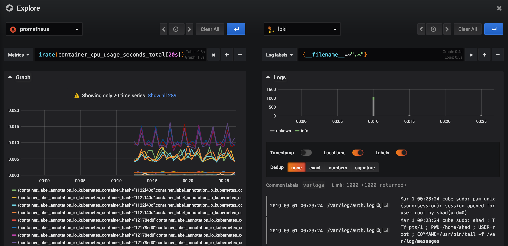

# Monitoring
## Start & Stop

```bash
# Start
docker-compose up -d

# Stop
docker-compose down
```

<p align="center"></p>

## Components

This playground contains:
* `loki` - storage for logs
* `promtail` that scrapes logs from your `/var/log` directory and puts to `loki`
* `cadvisor` - exports metrics of running docker containers
* `prometheus` - storage for metrics, get metrics from `cadvisor`, interface: [http://localhost:9090](http://localhost:9090)
* `grafana` with pre-configured both datasources — `loki` and `prometheus`, interface: [http://localhost:3000](http://localhost:3000), `admin`/`test`

See [initial specifications here](./docs/design-document.md)