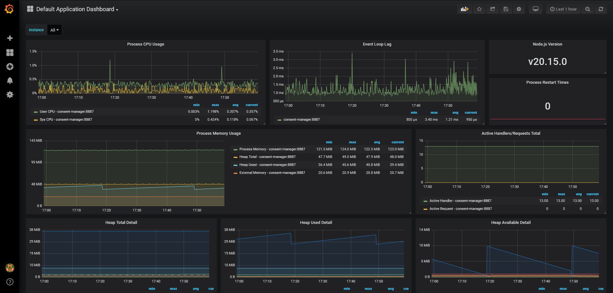
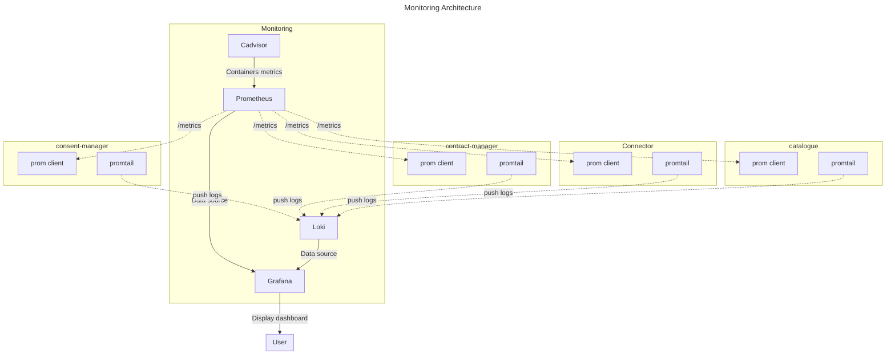
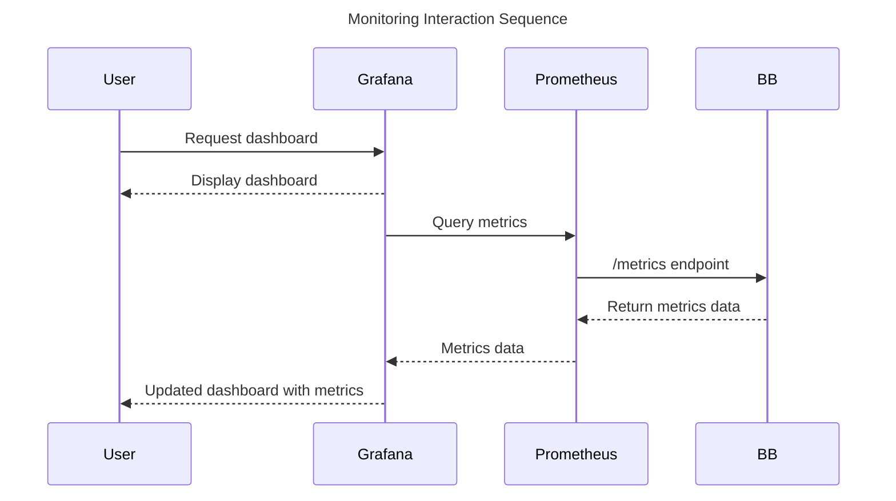

# Monitoring Design Document

The monitoring stack consists of Prometheus for collecting and storing metrics, and Grafana for visualizing these metrics.
This stack provides a robust solution for monitoring the performance and health of the other Building Blocks.

## Technical usage scenarios & Features

The monitoring allows to observe and understand the system performance, availability, and health of each building block.

### Features/main functionalities

- Comprehensive Observability
- Real-time Alerting
- Scalability and Performance
- Flexibility and Customizability
- Secure Data Handling
- Ease of Integration

### Technical usage scenarios

- Provide an end-to-end observability platform that covers metrics, alerts, logs, and traces, allowing organizations to fully understand their infrastructure and application state.
- Enable immediate notification on system anomalies, outages, or threshold breaches, ensuring timely responses to critical issues.
- Ensure the monitoring system scales seamlessly with the growth of the infrastructure it monitors, without sacrificing performance.
- Offer a flexible monitoring setup that can be tailored to unique organizational needs, from custom dashboards to specific alert rules.
- Ensure all monitored data, both in transit and at rest, is handled securely with encryption, access controls, and data governance policies.
- Provide simple, well-documented mechanisms to integrate a variety of services, applications, and platforms into the monitoring setup.

## Requirements

- MUST provide a visualization of the metrics
- MUST provide configurable alerts
- MUST be scalable and customizable
- MUST be secure
- MUST be easy to integrate

## Integrations

### Direct Integrations with Other BBs

The monitoring allows an integration with all the other BBs.

### Integrations via Connector

Through the dataspace connector, the monitoring system will be able to process events and alerts running during any kind of data transaction to be directly interpreted and visualisable in the monitoring dashboards.

## Relevant Standards

### Data Format Standards

- [Prometheus remote-write 1.0](https://prometheus.io/docs/specs/remote_write_spec/)

## Input / Output Data

This BB will scrape data from different data sources to gather metrics.
One of the most efficient ways is to display metrics on an endpoint "/metrics" readable by Prometheus.

```json
# HELP process_cpu_user_seconds_total Total user CPU time spent in seconds.
# TYPE process_cpu_user_seconds_total counter
process_cpu_user_seconds_total{app="consent-manager"} 95.43957500000002

# HELP process_cpu_system_seconds_total Total system CPU time spent in seconds.
# TYPE process_cpu_system_seconds_total counter
process_cpu_system_seconds_total{app="consent-manager"} 38.96242699999998

# HELP process_cpu_seconds_total Total user and system CPU time spent in seconds.
# TYPE process_cpu_seconds_total counter
process_cpu_seconds_total{app="consent-manager"} 134.40200200000015

# HELP process_start_time_seconds Start time of the process since unix epoch in seconds.
# TYPE process_start_time_seconds gauge
process_start_time_seconds{app="consent-manager"} 1719495996

# HELP process_resident_memory_bytes Resident memory size in bytes.
# TYPE process_resident_memory_bytes gauge
process_resident_memory_bytes{app="consent-manager"} 130584576

```

As a third-party component Prometheus will gather and stock all this data to keep them available for Grafana to be displayed in a dashboard

<p align="center"></p>

## Architecture

The architecture of the monitoring stack includes the following components:

1. **Prometheus Server**
2. **Grafana Server**
3. **Loki**
4. **Prom client**
5. **Cadvisor**
6. **Prom trail** (optional)



### Technical Specifications

#### Prometheus Server

- **Version:** Prometheus 2.7.1
- **Configuration:**
  - **Scrape Interval:** configurable
  - **Retention Period:** configurable
  - **Storage:** Local storage
  - **Alerting Rules:** Defined in YAML files and reloaded dynamically

- **Deployment Options:** Containers (Docker)

- **Networking:**
  - **Port:** 9090 by default (configurable)

#### Grafana Server

- **Version:** Grafana 6.0.0
- **Configuration:**
  - **Datasource:** Prometheus & Loki
  - **Dashboards:** a predefined dashboard is given

- **Deployment Options:**
  - Containers (Docker)

- **Networking:**
  - **Port:** 3000 by default (configurable)
  - **Access Control:** Use built-in authentication

#### Loki

- **Version:** latest version
- **Configuration:**
  - **Routes:** Define routing rules for different alert types
  - **Receivers:** Email, Slack, PagerDuty, etc. (to define)
  - **Grouping:** Group similar alerts to reduce noise
  - **Inhibition:** Suppress alerts based on conditions

- **Deployment Options:**
  - Containers (Docker)

- **Networking:**
  - **Port:** 9093 by default (configurable)

#### Prom client

- **Version:** Prom client latest version
- **Configuration:**
  - customizable

- **Deployment Options:**
  - application

#### Cadvisor

- **Version:** 0.33.0

#### Promtail

- **Version:** Promtail latest version

- **Deployment Options:**
  - to implement in docker compose BB's

##### docker compose example

```yaml
promtail:
    image: grafana/promtail:master
    volumes:
      - /var/log:/var/log
    networks:
      - monitoring_promtail-loki
networks:
  monitoring_promtail-loki:
    name: monitoring_promtail-loki
    external: true
```

## Dynamic Behaviour

The sequence diagram shows how the Monitoring communicates with other components and BBs.



## Configuration and deployment settings

The monitoring architecture can be deployed through docker and docker-compose using the following command:

```bash
docker compose up -d
```

### Environement variables

```bash
cp .env.sample .env
```

```dotenv
#.env.sample

PROM_PORT=9090 #Prometheus port
GRAFANA_PORT=3000 #Grafana port
GRAFANA_ADMIN_USER=admin # default user for grafana
GRAFANA_ADMIN_PWD=test # default user for grafana
CONSENT_MANAGER=consent-manager:8887 #URI of the app to monitor 
CONTRACT_MANAGER=contract-manager:8888 #URI of the app to monitor
CATALOG=catalog-api:4040 #URI of the app to monitor
CATALOG_REGISTRY=catalog-registry:3000 #URI of the app to monitor
```

### Prom Client

Across the different apps of Prometheus-X, the monitoring needs to be implemented and can be customized.
Prom clients have been used to easily give simple and default metrics to Prometheus.

#### installation

```bash
npm install prom-client
```

#### Implementation

```js
import client from "prom-client";

// Create a Registry to register the metrics
const register = new client.Registry();

// Define a default label which is added to all metrics
register.setDefaultLabels({
  app: 'my-express-app'
});

// Enable the collection of default metrics
client.collectDefaultMetrics({ register });

// Create a Counter metric for HTTP requests
const httpRequestCounter = new client.Counter({
  name: 'http_requests_total',
  help: 'Total number of HTTP requests',
  labelNames: ['method', 'route', 'status_code']
});
register.registerMetric(httpRequestCounter);

// Create a Histogram metric for HTTP request duration
const httpRequestDuration = new client.Histogram({
  name: 'http_request_duration_seconds',
  help: 'Duration of HTTP requests in seconds',
  labelNames: ['method', 'route', 'status_code']
});
register.registerMetric(httpRequestDuration);

// Middleware to count requests
app.use((req, res, next) => {
  res.on('finish', () => {
    httpRequestCounter.inc({ method: req.method, route: req.path, status_code: res.statusCode });
    httpRequestDuration.observe({ method: req.method, route: req.path, status_code: res.statusCode }, Date.now());
  });
  next();
});

// Route to expose metrics
app.get('/metrics', async (req, res) => {
  res.set('Content-Type', register.contentType);
  res.end(await register.metrics());
});

```

### Monitoring Scope

#### Express App

To go further in the customization of the metrics, some of them can be business logic metrics.
As an example, there is the metrics of the number of refused consent inside the consent-manager BB.

#### **metrics.ts**

```typescript
import client from "prom-client";

const register = new client.Registry();

register.setDefaultLabels({
    app: process.env.APPLICATION_NAME,
});

const httpRequestCounter = new client.Counter({
    name: 'http_requests_total',
    help: 'Total number of HTTP requests',
    labelNames: ['method', 'route', 'status_code']
});
register.registerMetric(httpRequestCounter);

const httpRequestDuration = new client.Histogram({
    name: 'http_request_duration_seconds',
    help: 'Duration of HTTP requests in seconds',
    labelNames: ['method', 'route', 'status_code']
});
register.registerMetric(httpRequestDuration);

// Create a Counter metric for refused consent
const refusedConsent = new client.Counter({
    name: 'refused_consent',
    help: 'number of consent refused',
});
register.registerMetric(refusedConsent);

export {
    client,
    httpRequestCounter,
    register,
    httpRequestDuration,
    refusedConsent
}
```

All the metrics can be defined and exported in the same file and being imported where it is needed

#### **server.ts**

```typescript
import express, { json as expressJson } from "express";
import {client, register, httpRequestCounter, httpRequestDuration} from "./utils/metrics";

export const startServer = () => {
  const app = express();
  const port =  3000;

    //Default metrics
    client.collectDefaultMetrics({ register });

    // increment http request middleware
    app.use((req, res, next) => {
      res.on('finish', () => {
        httpRequestCounter.inc({ method: req.method, route: req.path, status_code: res.statusCode });
        httpRequestDuration.observe({ method: req.method, route: req.path, status_code: res.statusCode }, Date.now());
      });
      next();
    });

    //metrics endpoint
    app.get('/metrics', async (req, res) => {
      res.set('Content-Type', register.contentType);
      res.end(await register.metrics());
    });
    

  // Start the server
  const server = app.listen(port, () => {
    //eslint-disable-next-line
    console.log(`Consent manager running on: http://localhost:${port}`);
  });

  return { server, app }; // For tests
};
```

#### **consentController.ts**

```typescript
import {refusedConsent} from "../utils/metrics";

export const refuseConsent = async (
        req: Request,
        res: Response,
        next: NextFunction
) => {
  try {
    // logic here
    
    // increment the counter
    refusedConsent.inc();
    return res.status(200);
  } catch (err) {
    Logger.error(err);
    next(err);
  }
};
```

## Third Party Components & Licenses

- [Prometheus](https://github.com/prometheus/prometheus/blob/main/LICENSE)
- [Loki](https://github.com/grafana/loki/blob/main/LICENSE)
- [prom client](https://github.com/siimon/prom-client/blob/master/LICENSE)
- [Grafana](https://github.com/grafana/grafana/blob/main/LICENSE)

## OpenAPI Specification

_In the future: link your OpenAPI spec here._

## Test specification

### Test plan

This BB is composed exclusively of third-party components so the strategy will be to test the metrics on the BBs directly.
